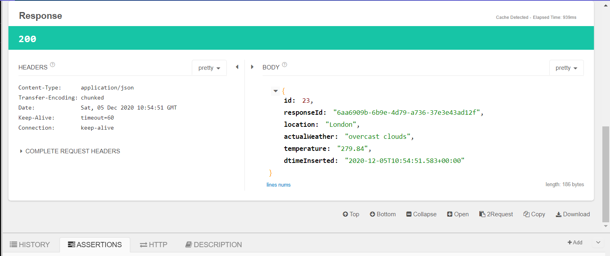

# weather-demo
demo for weather application

# application api
http://localhost:8182/api/weather/by-location

# request body (sample)
{
	"location": "London"
}

# HTTP 200

# HTTP 500

# HTTP 415

# HTTP 405

# ORACLE DB

